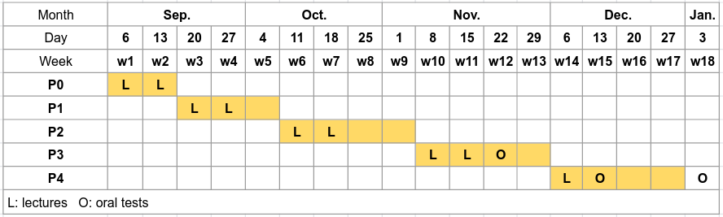

# Operating System Labs

Dept. of Computer Science, ECNU, Fall 2021

## Basic 

### Time and Venue

* Lectures: &nbsp;  Monday 8:00am - 9:35am @ 教书院 413
* Labs: &nbsp; Monday 9:50am - 11:25am @ 理科楼 B519 

### Stuff

Instructor: &nbsp; Yuanbin Wu  
Email: &nbsp; ybwu\[at\]cs.ecnu.edu.cn  
Office: &nbsp; 911 Science Building B

TA1: &nbsp; Wei Du  
Email: &nbsp; 51215901009\[at\]stu.ecnu.edu.cn

TA2: &nbsp; Jie Wang  
Email: &nbsp; 10185102223\[at\]stu.ecnu.edu.cn

### Submission

We will rely on [Github Classroom](https://classroom.github.com/) to manage assignments.
To submit projects, please 
  - first get a [github](https://www.github.com) account.
  - for each project, click ``invite link`` to accept the project assignment 
(you may be required to link your github account to your student number when accepting the first project).
  - after accepting, a repository is created for your project, and you (for individual project) or your group (for group project) will develop the project in this repository.
  - when a project's deadline is passed, TAs grade your project based on the last commit before the deadline.

## Projects

### Topics

* Project 0a [Get familiar with Linux](../projects/linux/linux_warmup/), 
[invite link](https://classroom.github.com/a/fjsA2ARW)

* Project 0b [Sorting](../projects/linux/sorting/), 
[invite link](https://classroom.github.com/a/wK8pdx4l)

* Project 1a [A Unix Shell](../projects/linux/myshell/),
[invite link](https://classroom.github.com/a/2ANYvHjH)

* Project 1b [xv6 System Call](../projects/xv6/system_call/),
[invite link](https://classroom.github.com/a/wekVha0B)
* Project 2: 
  - 2a [Dynamic Memory Allocation](../projects/linux/malloc/)
  - 2b [xv6 Scheduling](../projects/xv6/scheduling/)

<!--
* Project 3: 
  - 3a [Locks and Threads](projects/linux/lock_thread/docs/thread.md)
  - 3b [xv6 VM Layout](projects/xv6/vmlayout/docs/xv6_vmlayout.md)

* Project 4: 
  - 4a [File Defragmentation](projects/linux/defragmentation/docs/defragmentation.md)
  - 4b [xv6 Kernel Thread](projects/xv6/thread/docs/xv6_thread.md)

-->

### xv6 lab environments

- [How to](../xv6env/),
- [xv6](../xv6env/xv6.tar.gz), [qemu](../xv6env/qemu-6.828-2.9.0.tar.gz), [Dockerfile](../xv6env/Dockerfile)
- [Troubleshot (lab machines)](../xv6env/qemu-lab-install.pdf)

Notes: For all xv6 projects, we start from a clean version of xv6 kernel (i.e., projects are independet with each other). 

### Lecture Slides

* [Lecture 1](slides/lecture-1.pdf), 
* [Lecture 2](slides/lecture-2.pdf)
* [Lecture 3](slides/lecture-3.pdf)
<!--
* [Lecture 4](slides/lecture-4.pdf)
* [Lecture 5](slides/lecture-5.pdf)
* [Lecture 6](slides/lecture-6.pdf)
* [Lecture 7](slides/lecture-7.pdf)
-->

### Lab Slides
* [Lab1part1](slides/lab1part1.pdf) ,   [Lab1part2](slides/lab1part2.pdf)
* [Lab2 git](slides/lab2git.pdf)
* [Lab4 make](slides/lab4make.pdf)

### Timeline (tentative)

 

### Plagiarism Policy

**ALL** participants will loss **ALL** credits of the project 
if any improper code/doc sharing is discovered.

### Late Policy

* For P0, P1, late handins will NOT be accepted.
* For P2, P3, P4:
    - Your group will have 3 “late days”.
    - You need to email TA at least 1 hour before the deadline.   
    - If all your 3 “late days” are used, late handins will not be accepted.

## Readings

**Main**

* [Operating Systems: Three Easy Pieces](http://pages.cs.wisc.edu/~remzi/OSTEP/),  
  Remzi H. Arpaci-Dusseau and Andrea C. Arpaci-Dusseau

**Unix Programming**

* Advanced Programming in the UNIX Environment,   
  W. Richard Stevens, Stephen A. Rago

**C Programming**

* The C Programming Language,  
  Brian W Kernighan, Dennis M. Ritchie

**Linux Kernel**

* Linux Kernel Development,  
  Robert Love

